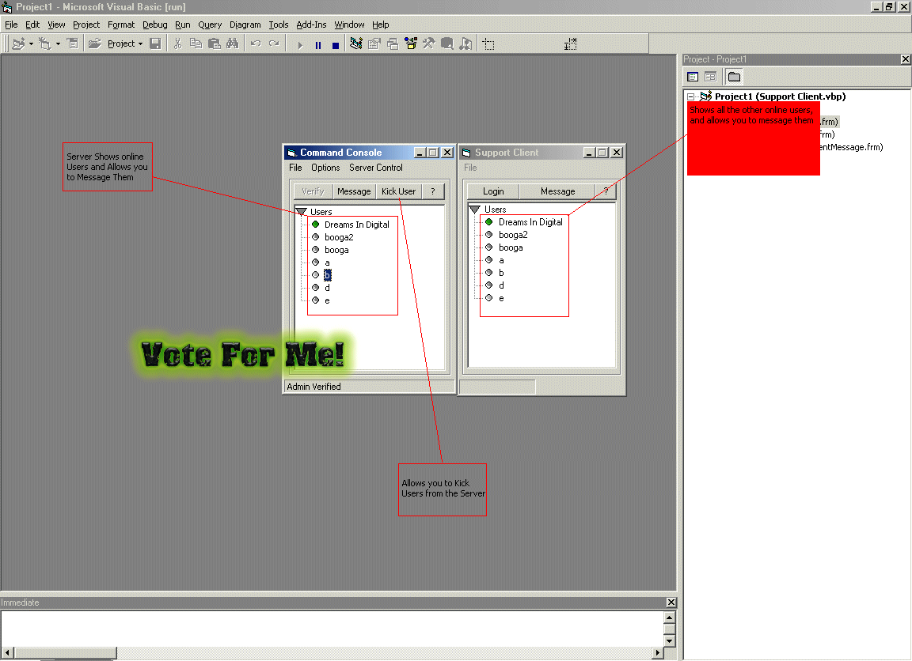



## Mutli Client Messenger \-\- Server / Client

### Description

This is a Messenger server that supports multiple clients, along with the client application. PLEASE VOTE FOR ME!! .. and if you have any questions/comments/suggestions, email me.
 
### More Info
 
It has a few errors and incomplete things, but could easily be expanded and turned into a full scale messenger server. It took me about 2 days to write. and it has quite a few functions that could easily be used for other applications.

no known side effects, if found e-mail me.

             |
---                |---
**Submitted On**   |2002-07-14 01:40:30
**By**             |[Robert Cleaver](https://github.com/Planet-Source-Code/PSCIndex/blob/master/ByAuthor/robert-cleaver.md)
**Level**          |Advanced
**User Rating**    |4.2 (21 globes from 5 users)
**Compatibility**  |VB 6\.0
**Category**       |[Miscellaneous](https://github.com/Planet-Source-Code/PSCIndex/blob/master/ByCategory/miscellaneous__1-1.md)
**World**          |[Visual Basic](https://github.com/Planet-Source-Code/PSCIndex/blob/master/ByWorld/visual-basic.md)
**Archive File**   |[Mutli\_Clie1098607242002\.zip](https://github.com/Planet-Source-Code/robert-cleaver-mutli-client-messenger-server-client__1-37216/archive/master.zip)

